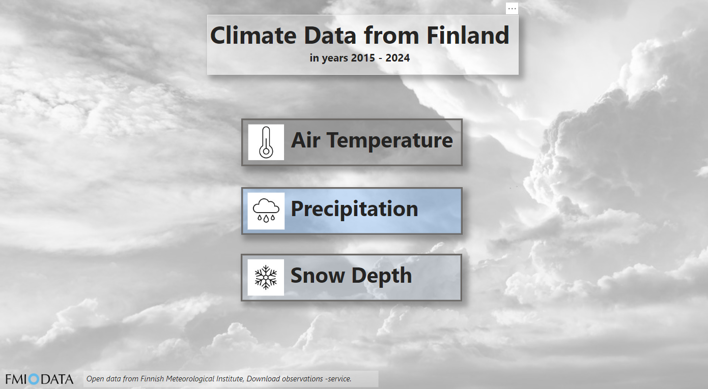
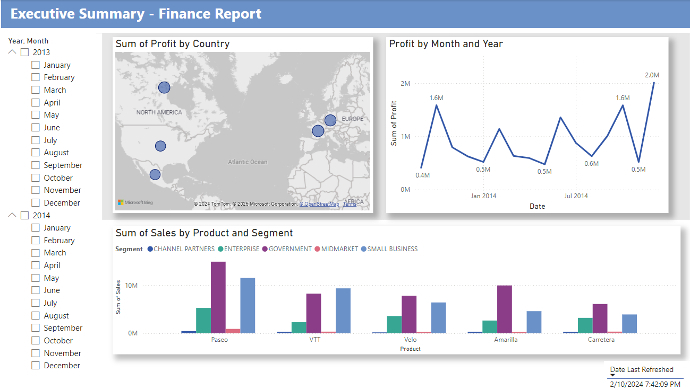
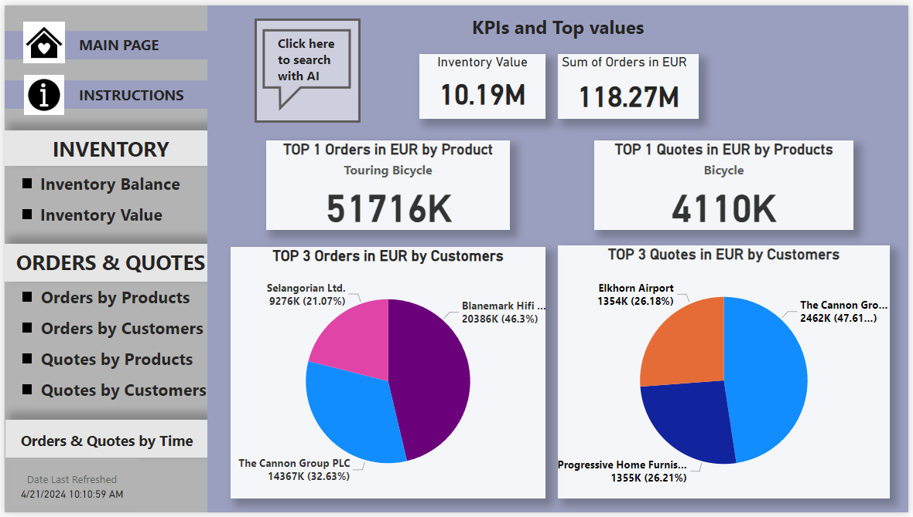
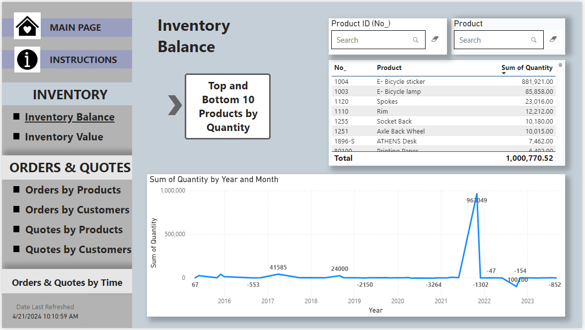
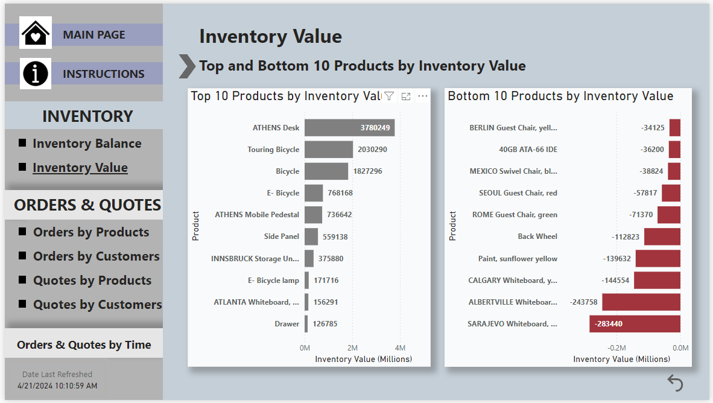
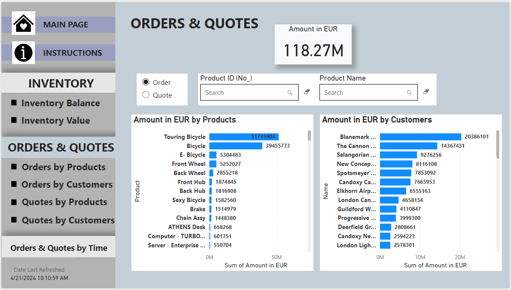
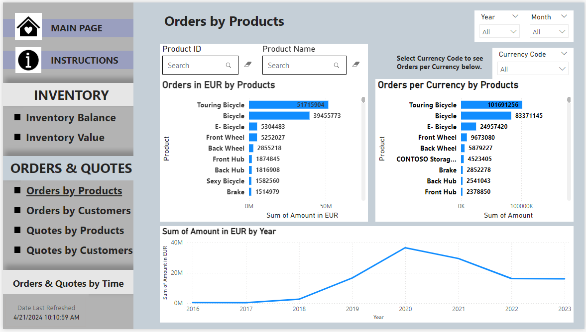
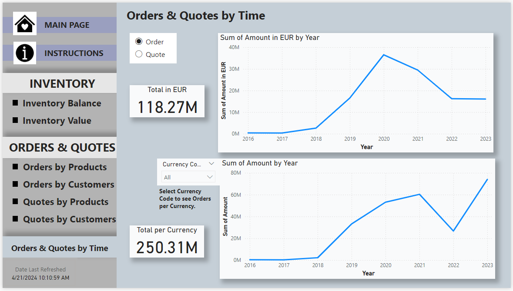

# My Project Portfolio

## Overview
Welcome to my project Portfolio! 
Here, you'll find a selection of projects showcasing my skills in data analytics using Power BI. 

This portfolio is a work in progress and will be regularly updated with new tools and projects as I continue to learn and grow.  

## Power BI -projects

### 📌 Climate data from Finland 

- Climate data from Finland in years 2015-2024 (open data from Finnish Meteorological Institute).
- Data is collected from three locations: Espoo, Tampere and Utsjoki.
- This project examines the climate through air temperature, precipitation and snow depth.
- Download [ClimateData_Report](ClimateData_Report.pbix) Power BI File
  
  
    
  
### 📌 Finance Report 

- This exercise is a tutorial from Microsoft's Learn platform. See the tutorial instructions [here](https://learn.microsoft.com/en-us/power-bi/create-reports/desktop-excel-stunning-report).
- Download [Finance_report](Finance_report_practise.pbix) Power BI File
  

  
### 📌 Inventory & Sales Project 
- This exercise is part of the school project, where a Power BI solution was independently designed based on the provided data.
- This project is presented using the screenshots below.
  
  

    
Main Page

    
  

  

    
Inventory Balance

    
  

  

    
Inventory Top 10 values

    
  

  

    
Orders & Quotes

    
  

  

    
Orders by Products

    
  

  

    
Orders and Quotes by Time

    
  

